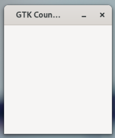
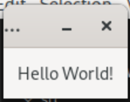
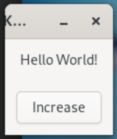

# Counter App with GTK4 and Rust
## GTK and Rust
GTK is a free and open-source cross-platform widget toolkit for creating graphical user interfaces (GUIs).

Rust is a fast, reliable and productive language for building software on embedded devices, web services and more. It is a system programming language focused on safety, speed and concurrency.

Focus of this tutorial is to write a counter app with GTK 4 and Rust.

## Project Setup
Let's begin by installing all necessary tools. First, follow the instructions on the [GTK website](https://www.gtk.org/docs/installations/) in order to install GTK 4. Then install Rust with [rustup](https://rustup.rs/). We are targeting GTK4, Rust 1.75 and gtk-rs version 0.7.3 with features `v4_12`.

Now lets create a new project by executing:
```
cargo new counter-app-with-gtk4-and-rust
```

Add [gtk4 crate]() to your dependencies in `Cargo.toml`. 
```
cargo add gtk4 --rename gtk --features v4_12
```

Now we can run our application by executing:
```
cargo run
```
At this moment it would print `Hello, world!`.

## Application
Lets start by creating GTK Application and connting to `activate` event of the Application. We will create a method `build_ui` to create a window and display it.

```rust
use gtk::prelude::*;
use gtk::{glib, Application, ApplicationWindow};

const APP_ID: &str = "org.gtk_rs.GTK4Counter";

fn main() -> glib::ExitCode {
// Create a new application
    let app = Application::builder().application_id(APP_ID).build();

    // Connect to "activate" signal of `app`
    app.connect_activate(build_ui);

    // Run the application
    app.run()
}

fn build_ui(app: &Application) {
    // Create a window and set the title
    let window = ApplicationWindow::builder()
        .application(app)
        .title("GTK Counter App")
        .build();

    // Present window
    window.present();
}
```
This will dispaly an empty window. Time to add some content.
<figure>
  <a href="images/01-blank-window.png"></a>
  <figcaption>Empty GTK Window</figcaption>
</figure>

## Label
Lets start by adding a `Label` and displaying `Hello World!` text. Add `Label` to `gtk` imports.

Add following to `build_ui` method.
```rust
    let label_counter = Label::builder()
        .label("Hello World!")
        .margin_top(12)
        .margin_bottom(12)
        .margin_start(12)
        .margin_end(12)
        .build();
```

And add `label_counter` as child of window.
```rust
    let window = ApplicationWindow::builder()
        .application(app)
        .title("GTK Counter App")
        .child(&label_counter)
        .build();
```
Running the application now would display `Hello World!` text in the window.
<figure>
  <a href="images/02-hello-world.png"></a>
  <figcaption>Empty GTK Window</figcaption>
</figure>

## Increment Button
Lets create a button
```rust
    let button_increase = Button::builder()
        .label("Increase")
        .margin_top(12)
        .margin_bottom(12)
        .margin_start(12)
        .margin_end(12)
        .build();
```
Now that we have multiple widgets, we would add a `gtk_box` to hold all the child elements and add that `gtk_box` as child to window instead.
```rust
    let gtk_box = Box::builder()
        .orientation(Orientation::Vertical)
        .build();
    gtk_box.append(&label_counter);
    gtk_box.append(&button_increase);

    ...
        .child(&gtk_box)
    ...
```
<figure>
  <a href="images/03-increase-button.png"></a>
  <figcaption>Empty GTK Window</figcaption>
</figure>

## Add Click Handler
Lets add a counter and button click handler. We will update the counter and update the `label_counter` with the value. Out `counter` variable would need to be put inside `Rc` and `Cell` (not sure if I am using the term correctly) to enable multiple owners and mutable access to variable.

Variable declare will look like following and set label value.
```rust
    let counter = Rc::new(Cell::new(0));
    ...
    .label(&counter.get().to_string())
    ...
```

Lets add a click handler for the `button_increase`.
```rust
    button_increase.connect_clicked(clone!(@strong counter, @weak label_counter =>
        move |_| {
            counter.set(counter.get() + 1);
            label_counter.set_label(&counter.get().to_string());
    }));
```

## Add Decrease Button and Handler
Lets add another button to decrease the value and update the value
```rust
    let button_decrease = Button::builder()
        .label("Decrease")
        .margin_top(12)
        .margin_bottom(12)
        .margin_start(12)
        .margin_end(12)
        .build();
    
    button_decrease.connect_clicked(clone!(@weak label_counter =>
        move |_| {
            counter.set(counter.get() - 1);
            label_counter.set_label(&counter.get().to_string());
    }));
```

## Source
Source code for the demo application is hosted on GitHub in [blog-code-samples](https://github.com/kashifsoofi/blog-code-samples/tree/main/counter-app-with-gtk4-and-rust) repository.

## References
In no particular order
* [GTK](https://www.gtk.org/)
* [GTK Installation](https://www.gtk.org/docs/installations/)
* [Rust](https://www.rust-lang.org/)
* [rustup](https://rustup.rs/)
* [gtk-rs](https://gtk-rs.org/)
* [grk4 crate](https://crates.io/crates/gtk4)
* [GUI development with Rust and GTK 4](https://gtk-rs.org/gtk4-rs/stable/latest/book/)
* 
* And many more