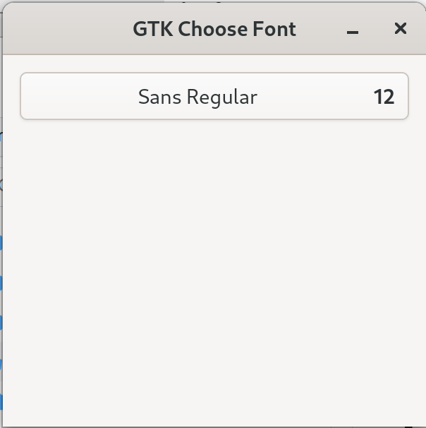
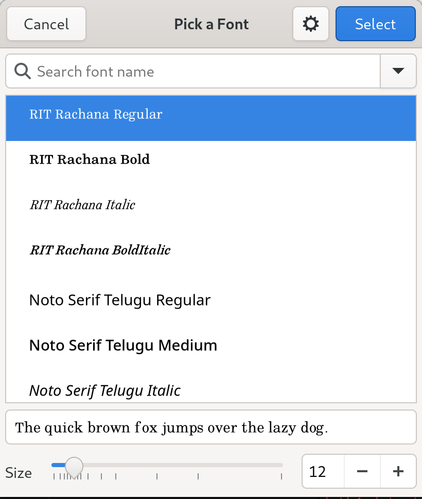

# Choose Font with GTK4 and .NET 8
## GTK and .NET
GTK is a free and open-source cross-platform widget toolkit for creating graphical user interfaces (GUIs).

.NET is the free, open-source, cross-platform framework for building modern apps and powerful cloud services.

Focus of this tutorial is to write an app to choose font with GTK 4 and C# targeting .NET 8.

## Project Setup
Let's begin by installing all necessary tools. First, follow the instructions on the [GTK website](https://www.gtk.org/docs/installations/) in order to install GTK 4. Then install .NET by following instructions for your platform from [download](https://dotnet.microsoft.com/en-us/download) page. We are targeting GTK4, .NET 8 and Gir.Core.Gtk-4.0 0.4.0.

Now lets create a new empty folder named `gtk4-dotnet8-fontdialog` and execute following to create an empty solution:
```shell
dotnet new sln
```

Next we will add a console application and add that to our solution
```shell
dotnet new console -o FontDialog.App
dotnet sln add FontDialog.App/FontDialog.App.csproj
```
New lets add C# bindings for Gtk4 to our `Counter.App` project
```shell
cd Counter.App
dotnet add package GirCore.Gtk-4.0 --version 0.5.0-preview.3
```
Now we can run our application by executing:
```shell
dotnet run
```
At this moment it would print `Hello, world!`.

## Application
Lets start by creating GTK Application and add an `OnActivate` event handler to create the application window and display it.

GTK provides a widget `FontDialogButton` to get the selected font. This widget expects a `FontDialog` to make the font selection, we will create a `FontDialog` also available with GTK and then create an instance of `FontDialogButton` and add it to our window. We don't have to do anything else, clicking on button opens the dialog and selected font is updated on the button.

Code for the program is below following the screenshots.
```csharp
var application = Gtk.Application.New("org.GirCore.GTK4FontDialog", Gio.ApplicationFlags.FlagsNone);
application.OnActivate += (sender, args) =>
{
    var fontDialog = Gtk.FontDialog.New();
    var fontDialogButton = Gtk.FontDialogButton.New(fontDialog);
    fontDialogButton.SetMarginTop(12);
    fontDialogButton.SetMarginBottom(12);
    fontDialogButton.SetMarginStart(12);
    fontDialogButton.SetMarginEnd(12);

    var gtkBox = Gtk.Box.New(Gtk.Orientation.Vertical, 0);
    gtkBox.Append(fontDialogButton);

    var window = Gtk.ApplicationWindow.New((Gtk.Application)sender);
    window.Title = "GTK Choose Font";
    window.SetDefaultSize(300, 300);
    window.Child = gtkBox;
    window.Show();
};
return application.RunWithSynchronizationContext();
```

<figure>
  <a href="images/01-font-dialog-button.png"></a>
  <figcaption>Font Dialog Button</figcaption>
</figure>

<figure>
  <a href="images/02-font-dialog.png"></a>
  <figcaption>Empty GTK Window</figcaption>
</figure>

## Choose Font with Button
By using `FontDialogButton` we don't have to manage opening up `FontDialog`. Lets add a label to dispaly selected font and a button that we would use to display `FontDialog` on click.

```csharp
    var labelCounter = Gtk.Label.New("Hello World!");
    labelCounter.SetMarginTop(12);
    labelCounter.SetMarginBottom(12);
    labelCounter.SetMarginStart(12);
    labelCounter.SetMarginEnd(12);
```

And add `labelCounter` as child of window.
```csharp
    var window = Gtk.ApplicationWindow.New((Gtk.Application)sender);
    window.Title = "GTK Counter App";
    window.SetDefaultSize(300, 300);
    window.Child = labelCounter;
    window.Show();
```

Running the application now would display `Hello World!` text in the window.
<figure>
  <a href="images/02-hello-world.png"></a>
  <figcaption>Hello World</figcaption>
</figure>

## Increment Button
Lets create a button
```csharp
    var buttonIncrease = Gtk.Button.New();
    buttonIncrease.Label = "Increase";
    buttonIncrease.SetMarginTop(12);
    buttonIncrease.SetMarginBottom(12);
    buttonIncrease.SetMarginStart(12);
    buttonIncrease.SetMarginEnd(12);
```
Now that we have multiple widgets, we would add a `Gtk.Box` to hold all the child elements and add that `Box` as child to window instead.
```csharp
    var gtkBox = Gtk.Box.New(Gtk.Orientation.Vertical, 0);
    gtkBox.Append(labelCounter);
    gtkBox.Append(buttonIncrease);

    ...
    window.Child = gtkBox;
    ...
```
<figure>
  <a href="images/03-increase-button.png"></a>
  <figcaption>Increase Button</figcaption>
</figure>

## Add Click Handler
Lets add a counter and button click handler. We will update the counter and update the `labelCounter` with the value. 

Variable declare will look like following and set label value.
```csharp
    var counter = 0;
    
    var labelCounter = Gtk.Label.New(counter.ToString());
    ...
```

Lets add a click handler for the `buttonIncrease`.
```csharp
    buttonIncrease.OnClicked += (_, _) =>
    {
        counter++;
        labelCounter.SetLabel(counter.ToString());
    };
```
<figure>
  <a href="images/04-incremented-value.png"></a>
  <figcaption>Incremented Value</figcaption>
</figure>

## Add Decrease Button and Handler
Lets add another button to decrease the value and update label.
```csharp
    var buttonDecrease = Gtk.Button.New();
    buttonDecrease.Label = "Decrease";
    buttonDecrease.SetMarginTop(12);
    buttonDecrease.SetMarginBottom(12);
    buttonDecrease.SetMarginStart(12);
    buttonDecrease.SetMarginEnd(12);
    buttonDecrease.OnClicked += (_, _) =>
    {
        counter--;
        labelCounter.SetLabel(counter.ToString());
    };
```
<figure>
  <a href="images/05-counter-app.png"></a>
  <figcaption>Counter App</figcaption>
</figure>

## Source
Source code for the demo application is hosted on GitHub in [blog-code-samples](https://github.com/kashifsoofi/blog-code-samples/tree/main/gtk4-dotnet8-counter-app) repository.

## References
In no particular order
* [GTK](https://www.gtk.org/)
* [GTK Installation](https://www.gtk.org/docs/installations/)
* [.NET](https://dotnet.microsoft.com/en-us/)
* [.NET Download](https://dotnet.microsoft.com/en-us/download)
* [Gir.Core](https://github.com/gircore/gir.core)
* [GirCore.Gtk-4.0](https://www.nuget.org/packages/GirCore.Gtk-4.0/)
* [Gir.Core Gtk-4.0 Samples](https://github.com/gircore/gir.core/tree/main/src/Samples/Gtk-4.0)
* And many more