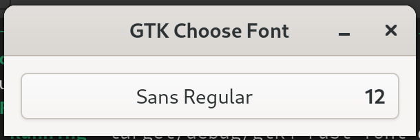
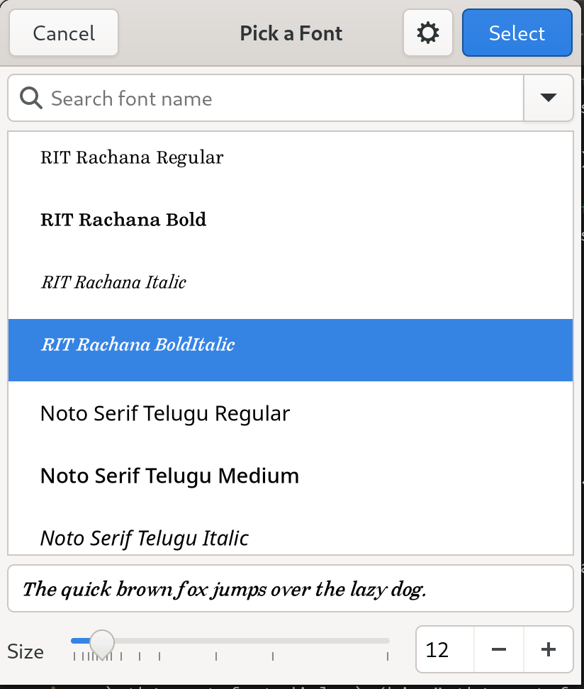
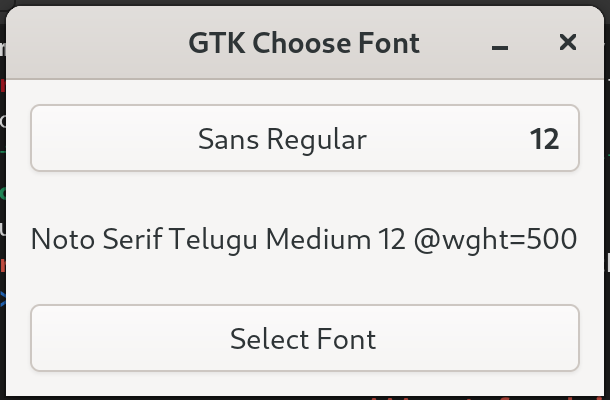

# Choose Font with GTK4 and Rust

## GTK and Rust
GTK is a free and open-source cross-platform widget toolkit for creating graphical user interfaces (GUIs).

Rust is a fast, reliable and productive language for building software on embedded devices, web services and more. It is a system programming language focused on safety, speed and concurrency.

Focus of this tutorial is to write an app to choose font with GTK 4 and Rust.

## Project Setup
Let's begin by installing all necessary tools. First, follow the instructions on the [GTK website](https://www.gtk.org/docs/installations/) in order to install GTK 4. Then install Rust with [rustup](https://rustup.rs/). We are targeting GTK4, Rust 1.75 and gtk-rs version 0.7.3 with features `v4_12`.

Now lets create a new project by executing:
```
cargo new gtk4-rust-font-dialog
```

Add [gtk4 crate]() to your dependencies in `Cargo.toml`. 
```
cargo add gtk4 --rename gtk --features v4_12
```

## Application
Lets start by creating GTK Application and connecting to `activate` event of the Application. We will create a method `build_ui` to create a window and display it. GTK4 provides a widget `FontDialogButton`, that can be added to a preferences or settings window of the application. It displays current (default) font. Clicking on it will launch the `FontDialog` also provided by GTK4 that gives uer the ability to select a font.

The whole listing of the `main.rs` is below following the screenshots.

```rust
use glib::clone;
use gtk::prelude::*;
use gtk::{
    self, gio, glib, pango, Application, ApplicationWindow, Button, FontDialog, FontDialogButton,
    Label, Orientation,
};

const APP_ID: &str = "org.gtk_rs.GTK4FontDialog";

fn main() -> glib::ExitCode {
    // Create a new application
    let app = Application::builder().application_id(APP_ID).build();

    // Connect to "activate" signal of `app`
    app.connect_activate(build_ui);

    // Run the application
    app.run()
}

fn build_ui(app: &Application) {
    let font_dialog = FontDialog::builder().modal(false).build();
    let font_dialog_button = FontDialogButton::builder()
        .dialog(&font_dialog)
        .margin_top(12)
        .margin_bottom(12)
        .margin_start(12)
        .margin_end(12)
        .build();

    // Add buttons to `gtk_box`
    let gtk_box = gtk::Box::builder()
        .orientation(Orientation::Vertical)
        .build();
    gtk_box.append(&font_dialog_button);

    // Create a window and set the title
    let window = ApplicationWindow::builder()
        .application(app)
        .title("GTK Choose Font")
        .child(&gtk_box)
        .build();
        
    // Present window
    window.present();
}
```
<figure>
  <a href="images/01-font-dialog-button.png"></a>
  <figcaption>Font Dialog Button</figcaption>
</figure>

<figure>
  <a href="images/02-font-dialog.png"></a>
  <figcaption>Font Dialog Button</figcaption>
</figure>

## Choose Font with Button
By using `FontDialogButton`, we don't show the `FontDialog` it is handled by the `FontDialogButton`. Lets add a label to display selected font and a button where we show the dialog on button click and get the selected font.
```rust
    let current_font = font_dialog_button.font_desc().expect("").to_string();
    let label_font = Label::builder()
        .label(current_font.to_string())
        .margin_top(12)
        .margin_bottom(12)
        .margin_start(12)
        .margin_end(12)
        .build();

    let button_select_font = Button::builder()
        .label("Select Font")
        .margin_top(12)
        .margin_bottom(12)
        .margin_start(12)
        .margin_end(12)
        .build();
```

We will setup the click handler after creating the window as need to pass the reference to click handler to set the parent of `FontDialog`. In the handler we will create a `FontDialog` and call `choose_font` method to display and select the font. We will update the `label_font` with the selected font on selection.
```rust
    button_select_font.connect_clicked(clone!(@weak window, @weak label_font =>
        move |_| {
            let font_dialog = FontDialog::builder().modal(false).build();
            let current_font = label_font.label();

            font_dialog.choose_font(
                Some(&window),
                Some(&FontDescription::from_string(&current_font.as_str())),
                None::<&gio::Cancellable>,
                clone!(@weak label_font => move |result| {
                    if let Ok(font_desc) = result {
                        label_font.set_label(&font_desc.to_string());
                    }
                }));
        }));
```
Shout out to [pacview preferences_window.rs](https://github.com/drakkar1969/pacview/blob/master/src/preferences_window.rs#L208) to help me figure out how to use the `choose_font` method.

<figure>
  <a href="images/03-button-select-font.png"></a>
  <figcaption>Font Dialog Button</figcaption>
</figure>

<figure>
  <a href="images/04-selected-font.png"></a>
  <figcaption>Font Dialog Button</figcaption>
</figure>

## Choose Font with Button (Async)
We can also choose font using a `Button` but by using the `async` version of the `choose_font`. Lets add another button and handler. Result would be the same.

```rust
    let button_select_font_async = Button::builder()
        .label("Select Font (async)")
        .margin_top(12)
        .margin_bottom(12)
        .margin_start(12)
        .margin_end(12)
        .build();
    ....
    button_select_font_async.connect_clicked(clone!(@weak window, @weak label_font =>
        move |_| {
            glib::spawn_future_local(clone!(@weak window, @weak label_font => async move {
                let font_dialog = FontDialog::builder().modal(false).build();
                let current_font = label_font.label();

                match font_dialog.choose_font_future(
                    Some(&window),
                    Some(&FontDescription::from_string(&current_font.as_str())),
                ).await {
                    Ok(font) => { label_font.set_label(&font.to_string()); }
                    Err(e) => { println!("{}", e); }
                }
            }));
        }));
```
Shout out to [rnote project](https://github.com/flxzt/rnote/blob/main/crates/rnote-ui/src/penssidebar/typewriterpage.rs#L124) to help me figure out how to use the async/await here.

## Source
Source code for the demo application is hosted on GitHub in [blog-code-samples](https://github.com/kashifsoofi/blog-code-samples/tree/main/gtk4-rust-font-dialog) repository.

## References
In no particular order
* [GTK](https://www.gtk.org/)
* [GTK Installation](https://www.gtk.org/docs/installations/)
* [Rust](https://www.rust-lang.org/)
* [rustup](https://rustup.rs/)
* [gtk-rs](https://gtk-rs.org/)
* [grk4 crate](https://crates.io/crates/gtk4)
* [GUI development with Rust and GTK 4](https://gtk-rs.org/gtk4-rs/stable/latest/book/)
* [pacview preferences_window.rs](https://github.com/drakkar1969/pacview/blob/master/src/preferences_window.rs#L208)
* [rnote project](https://github.com/flxzt/rnote/blob/main/crates/rnote-ui/src/penssidebar/typewriterpage.rs#L124)
* And many more