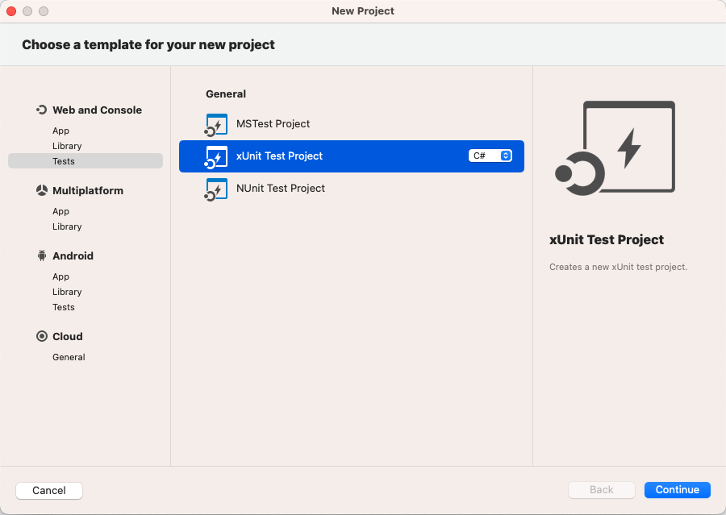
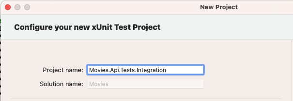

# Integration Testing SQL Server Store
This is a continuation of an earlier post [REST API with ASP.NET Core 7 and SQL Server](https://kashifsoofi.github.io/aspnetcore/rest/sqlserver/restapi-with-asp.net-core-7-and-sqlserver/). In this tutorial I will extend the sample to add integration tests to verify our implementation of `SqlServerMoviesStore`.

## Why Integration Test
As per definition from [Wikipedia](https://en.wikipedia.org/wiki/Integration_testing) integration testing is the phase in which individual software modules are combined and tested as a group.

This is important in our case as we are using an external system to store our data and before we can declare that it is ready to use we need to make sure that it is working as intended. It would also help us verify if our Dapper mapping is correct especially if we are using any custom mapping.

Our options are
* One way would be to run the database server and our api project and invoke the endpoints either from the Swagger UI, curl or Postman with defined data and then verify if our service is storing and retrieving the data correctly.This is tedious to do everytime we make a change, add or remove a property to our domain model, add a new endpoint for new use case.
* Add set of integration tests to our source code and run everytime we make a change, this would ensure that any change we have made has not broken any existing funcationality and scenario. Important thing to remember is this is not set in stone and these should be updated as the funcationality evolves, new functionality would lead to adding new test cases.

Focus of this article would be to implement automated integration tests for `SqlServerMoviesStore` we implemented earlier.

## Test Project
Let's start by adding a new test project.
* Right click on Solution name -> Add -> New Project -> Tests -> xUnit Test Project
<figure>
  <a href="images/001-new-project.png"></a>
  <figcaption>New xUnit Test Project</figcaption>
</figure>
* Select Target Framework, I have selected `.NET 7.0` as we are targeting `.NET 7.0` in this sample
* Name your test project, I like to name as Project I am testing followed by `.Tests` and followed by test types `.Integration`
<figure>
  <a href="images/002-name-project.png"></a>
  <figcaption>Name Test Project</figcaption>
</figure>
* Click create to finish creating test project.

### Setup
Start by adding nuget reference to our project `Movies.Api` in `Movies.Api.Tests.Integration` project and following nuget packages
```
dotnet add pacakge AutoFixture.Xunit2 --version 4.18.0
dotnet add pacakge FluentAssertions --version 6.11.0
dotnet add package Dapper.Contrib --version 2.0.78
```

In order to test funcationality provided by `SqlServerMoviesStore` we would need a way to access database without going through our store. This is to ensure that e.g. `Create` funcationlity works independent of `GetById` of the store. To accomplish that I would add a couple of helper classes under `Helper` folder.

#### DatabaseHelper.cs
```csharp
using System.Data;
using Dapper;
using Dapper.Contrib.Extensions;
using Microsoft.Data.SqlClient;

namespace Movies.Api.Tests.Integration.Helpers;

public class DatabaseHelper<TId, TRecord>
    where TRecord : class
    where TId : notnull
{
    protected readonly string connectionString;
	private readonly string tableName;
	private readonly string idColumnName;
    protected readonly Func<TRecord, TId> idSelector;

    public DatabaseHelper(
        string connectionString,
        string tableName,
        Func<TRecord, TId> idSelector,
        string idColumnName = "Id")
	{
        this.connectionString = connectionString;
		this.tableName = tableName;
		this.idColumnName = idColumnName;
		this.idSelector = idSelector;
	}

    public Dictionary<TId, TRecord> AddedRecords { get; } = new Dictionary<TId, TRecord>();

    public virtual async Task<TRecord> GetRecordAsync(TId id)
    {
        await using var connection = new SqlConnection(connectionString);
        return await connection.QueryFirstOrDefaultAsync<TRecord>(
            $"SELECT * FROM {tableName} WHERE {idColumnName} = @Id",
            new { Id = id },
            commandType: CommandType.Text);
    }

    public virtual async Task AddRecordAsync(TRecord record)
    {
        this.AddedRecords.Add(idSelector(record), record);
        await using var connection = new SqlConnection(connectionString);
        await connection.InsertAsync<TRecord>(record);
    }

    public async Task AddRecordsAsync(IEnumerable<TRecord> records)
    {
        foreach (var record in records)
        {
            await AddRecordAsync(record);
        }
    }

    public void TrackId(TId id) => AddedRecords.Add(id, default!);

    public virtual async Task DeleteRecordAsync(TId id)
    {
        await using var connection = new SqlConnection(connectionString);
        await connection.ExecuteAsync(
            $"DELETE FROM {tableName} WHERE {idColumnName} = @Id",
            new { Id = id },
            commandType: CommandType.Text);
    }

    public async Task CleanTableAsync()
    {
        foreach (var addedRecord in AddedRecords)
        {
            await DeleteRecordAsync(addedRecord.Key);
        }
    }
}
```
#### MoviesDatabaseHelper.cs
```csharp
using System.Data;
using Dapper;
using Microsoft.Data.SqlClient;
using Movies.Api.Store;

namespace Movies.Api.Tests.Integration.Helpers;

public class MoviesDatabaseHelper : DatabaseHelper<Guid, Movie>
{
	public MoviesDatabaseHelper(string connectionString)
		: base(connectionString, "Movies", x => x.Id, "Id")
    { }

    public async override Task AddRecordAsync(Movie record)
    {
        this.AddedRecords.Add(idSelector(record), record);

        var parameters = new
        {
            record.Id,
            record.Title,
            record.Director,
            record.ReleaseDate,
            record.TicketPrice,
            CreatedAt = DateTimeOffset.UtcNow,
            UpdatedAt = DateTimeOffset.UtcNow,
        };

        var query = @"
            INSERT INTO Movies(
                Id,
                Title,
                Director,
                ReleaseDate,
                TicketPrice,
                CreatedAt,
                UpdatedAt
            )
            VALUES (
                @Id,
                @Title,
                @Director,
                @ReleaseDate,
                @TicketPrice,
                @CreatedAt,
                @UpdatedAt
            )";

        await using var connection = new SqlConnection(connectionString);
        await connection.ExecuteAsync(query, parameters, commandType: CommandType.Text);
    }

    public async override Task<Movie> GetRecordAsync(Guid id)
    {
        await using var connection = new SqlConnection(connectionString);
        return await connection.QueryFirstOrDefaultAsync<Movie>(
            $"SELECT Id, Title, Director, ReleaseDate, TicketPrice, CreatedAt, UpdatedAt FROM Movies WHERE Id = @Id",
            new { Id = id },
            commandType: CommandType.Text);
    }
}
```
Next add a `DatabaseFixture` class to pass shared database context between test classes testing database, in our case it is `ConnectionString` that we would initialise in `InitializeAsync` method.
```csharp
namespace Movies.Api.Tests.Integration;

public class DatabaseFixture : IAsyncLifetime
{
    public string ConnectionString { get; private set; } = default!;

    public async Task InitializeAsync()
    {
        this.ConnectionString = "Server=localhost;Database=Movies;User ID=sa;Password=Password123;Encrypt=False";
        await Task.CompletedTask;
    }

    public async Task DisposeAsync()
    {
        await Task.CompletedTask;
    }
}
```
Next add a `DatabaseCollection.cs` file, this is so that we can pass the same `DatabaseContext` to multiple files.  This is here as an example as we only have a single class to test.
```csharp
namespace Movies.Api.Tests.Integration;

[CollectionDefinition("DatabaseCollection")]
public class DatabaseCollection : ICollectionFixture<DatabaseFixture>
{
    // This class has no code, and is never created. Its purpose is simply
    // to be the place to apply [CollectionDefinition] and all the
    // ICollectionFixture<> interfaces.
}
```
Let's also delete default `UnitTest1.cs` file.

### SqlServerMoviesStoreTests
I like to mirror the structure in the source project but please feel free to place your test file where you like. I will add a `Store` and under that a `SqlServer` folder and then create `SqlServerMoviesStoreTests.cs` file.

I will start by adding an instance of `moviesDatabaseHelper` and `sut` (system under test). In constructor, `moviesDatabaseHelper` is initialised using `ConnectionString` from `DatabaseFixture` then initialised an in memory configuration object and passed that to `SqlServerMoviesStore`.

I am calling `CleanTableAsync` in `DisposeAsync` method that will run after each test to cleanup any data inserted by the test.

#### SqlServerMoviesStoreTests.cs
```csharp
using AutoFixture.Xunit2;
using FluentAssertions;
using Microsoft.Extensions.Configuration;
using Movies.Api.Store;
using Movies.Api.Store.SqlServer;
using Movies.Api.Tests.Integration.Helpers;

namespace Movies.Api.Tests.Integration.Store.SqlServer;

[Collection("DatabaseCollection")]
public class SqlServerMoviesStoreTests : IAsyncLifetime
{
    private readonly MoviesDatabaseHelper moviesDatabaseHelper;

    private readonly SqlServerMoviesStore sut;

    public SqlServerMoviesStoreTests(DatabaseFixture databaseFixture)
	{
        moviesDatabaseHelper = new MoviesDatabaseHelper(databaseFixture.ConnectionString);

        var myConfiguration = new Dictionary<string, string?>
        {
            {"ConnectionStrings:MoviesDb", databaseFixture.ConnectionString},
        };

        var configuration = new ConfigurationBuilder()
            .AddInMemoryCollection(myConfiguration)
            .Build();

        sut = new SqlServerMoviesStore(configuration);
	}

    public Task InitializeAsync() => Task.CompletedTask;

    public async Task DisposeAsync()
    {
        await moviesDatabaseHelper.CleanTableAsync();
    }
}
```

### GetById Tests
Time to add tests. Please note to run these test first we would need to start our database server and apply the migrations. Lets go ahead and do that before adding our test.
```shell
docker-compose -f docker-compose.dev-env.yml up -d
```

Our first test is very easy, I like to name my tests as `MethodName_GivenCondition_ShouldExpectedResult` to follow the pattern, I have added `GetById_GivenRecordDoesNotExist_ShouldReturnNull` and I am going to leavarage excellent [AutoFixture](https://github.com/AutoFixture/AutoFixture) to get a new Guid as parameter. For this test we don't need arrange part, we would skip to the act and then assert. For Assertion I am going to use [FluentAssertions](https://fluentassertions.com/). For this test we need to assert the returned result is null.
```csharp
[Theory]
[AutoData]
public async void GetById_GivenRecordDoesNotExist_ShouldReturnNull(Guid id)
{
    // Arrange
    // Act
    var result = await sut.GetById(id);

    // Assert
    result.Should().BeNull();
}
```
Go ahead and run the test, it should be green.

Let's add our second test `GetById_GivenRecordExists_ShouldReturnRecord`, in this test we would first insert a new record using the helper we added earlier. In assertion step we would compare the result with instance passed by `AutoFixture` excluding `CreatedAt` and `UpdatedAt` properties as we know these would be set to current time when inserting. Instead we would test those are set to within 1 second of current time. I have also excluded `ReleasedAt` property and will match it within 1 second of passed value, in my opinion this is acceptable as this time being within 1 second of inserted time is accurate enough for this use case, however if more accuracy is needed we would look for an appropriate column type that provides that accuracy. Newly inserted record will be cleared after the test from `DisposeAsync` method.
```csharp
[Theory]
[AutoData]
public async void GetById_GivenRecordExists_ShouldReturnRecord(Movie movie)
{
    // Arrange
    await moviesDatabaseHelper.AddRecordAsync(movie);

    // Act
    var result = await sut.GetById(movie.Id);

    // Assert
    result.Should().NotBeNull();
    result.Should().BeEquivalentTo(
        movie,
        x => x.Excluding(p => p.ReleaseDate).Excluding(p => p.CreatedAt).Excluding(p => p.UpdatedAt));
    result.ReleaseDate.Should().BeCloseTo(movie.ReleaseDate, TimeSpan.FromSeconds(1));
    result.CreatedAt.Should().BeCloseTo(DateTimeOffset.UtcNow, TimeSpan.FromSeconds(1));
    result.UpdatedAt.Should().BeCloseTo(DateTimeOffset.UtcNow, TimeSpan.FromSeconds(1));
}
```

### GetAll Tests
First test is easy, we would just test if there are no records, `GetAll` return an empty collection.
```csharp
[Fact]
public async void GetAll_GivenNoRecords_ShouldReturnEmptyCollection()
{
    // Arrange
    // Act
    var result = await this.sut.GetAll();

    // Assert
    result.Should().BeEmpty();
}
```

Next test is to insert some records and executing `GetAll` and comparing the results. I have chosen not to assert the `DateTime` field values as we are doing that in `GetById` but those should be asserted if this method is in a separate class e.g. if we choose to have separate Command and Query classes.
```csharp
[Theory]
[AutoData]
public async void GetAll_GivenRecordsExist_ShouldReturnCollection(List<Movie> movies)
{
    // Arrange
    await moviesDatabaseHelper.AddRecordsAsync(movies);

    // Act
    var result = await this.sut.GetAll();

    // Assert
    result.Should().BeEquivalentTo(movies, x => x.Excluding(p => p.ReleaseDate).Excluding(p => p.CreatedAt).Excluding(p => p.UpdatedAt));
}
```

### Create Tests
First test for `Create` is straight forward, its going to call `Create` to create a record and then load that record using `moviesDatabaseHelper` and compare it with passed parameter.
```csharp
[Theory]
[AutoData]
public async void Create_GivenRecordDoesNotExist_ShouldCreateRecord(CreateMovieParams createMovieParams)
{
    // Arrange
    // Act
    await sut.Create(createMovieParams);
    moviesDatabaseHelper.TrackId(createMovieParams.Id);

    // Assert
    var createdMovie = await moviesDatabaseHelper.GetRecordAsync(createMovieParams.Id);

    createdMovie.Should().BeEquivalentTo(createMovieParams, x => x.Excluding(p => p.ReleaseDate));
    createdMovie.ReleaseDate.Should().BeCloseTo(createMovieParams.ReleaseDate, TimeSpan.FromSeconds(1));
    createdMovie.CreatedAt.Should().BeCloseTo(DateTimeOffset.UtcNow, TimeSpan.FromSeconds(1));
    createdMovie.UpdatedAt.Should().BeCloseTo(DateTimeOffset.UtcNow, TimeSpan.FromSeconds(1));
}
```
2nd test is to check if the method thorws an exeption if the id already exists. We will use `moviesDatabaseHelper` to add a new record first and then try to create a new record.
```csharp
[Theory]
[AutoData]
public async void Create_GivenRecordWithIdExists_ShouldThrowDuplicateKeyException(Movie movie)
{
    // Arrange
    await moviesDatabaseHelper.AddRecordAsync(movie);

    var createMovieParams = new CreateMovieParams(movie.Id, movie.Title, movie.Director, movie.TicketPrice, movie.ReleaseDate);

    // Act & Assert
    await Assert.ThrowsAsync<DuplicateKeyException>(async () => await sut.Create(createMovieParams));
}
```

### Update Tests
To test update, first we will create a record and then call the `Update` method of store to update the record. After updating we will use the `moviesDatabaseHelper` to load the saved record and verify if the saved record has expected values.
```csharp
[Theory]
[AutoData]
public async void Update_GivenRecordExists_ShouldUpdateRecord(Movie movie, UpdateMovieParams updateMovieParams)
{
    // Arrange
    await moviesDatabaseHelper.AddRecordAsync(movie);

    // Act
    await sut.Update(movie.Id, updateMovieParams);

    // Assert
    var saved = await moviesDatabaseHelper.GetRecordAsync(movie.Id);

    saved.Should().BeEquivalentTo(updateMovieParams, x => x.Excluding(p => p.ReleaseDate));
    saved.ReleaseDate.Should().BeCloseTo(updateMovieParams.ReleaseDate, TimeSpan.FromSeconds(1));
    saved.UpdatedAt.Should().BeCloseTo(DateTimeOffset.UtcNow, TimeSpan.FromSeconds(1));
}
```

### Delete Tests
To test delete, first we will add a new record using `moviesDatabaseHelper`, then call `Delete` method on store. To verify we will load the record and then assert the loaded values is `null`.
```csharp
[Theory]
[AutoData]
public async void Delete_GivenRecordExists_ShouldDeleteRecord(Movie movie)
{
    // Arrange
    await moviesDatabaseHelper.AddRecordAsync(movie);

    // Act
    await sut.Delete(movie.Id);

    // Assert
    var loaded = await moviesDatabaseHelper.GetRecordAsync(movie.Id);
    loaded.Should().BeNull();
}
```

This concludes the integration tests. Running these tests does need we start the databaes server prior to running the tests and run the migrations before running the tests. If the database is not running then the tests would not run.

## Integration Tests in CI
I am also adding 2 [GitHub Actions](https://github.com/features/actions) workflows to run these integration tests as part of the CI.

### Workflow with setting up SQL Server using GitHub Service Containers
In this workflow we would make use of the [GitHub service containers](https://docs.github.com/en/actions/using-containerized-services/about-service-containers) to start a SQL server. We will build migrations container and run it as part of the build process to apply migrations before running integration tests. Here is the full listing.
```yaml
name: Integration Test SQL Server (.NET)

on:
  push:
    branches: [ "main" ]
    paths:
     - 'integration-test-sqlserver-dotnet/**'

jobs:
  build:
    runs-on: ubuntu-latest
    defaults:
      run:
        working-directory: integration-test-sqlserver-dotnet

    services:
      movies.db.test:
        image: mcr.microsoft.com/mssql/server:2022-latest
        env:
          ACCEPT_EULA: Y
          MSSQL_SA_PASSWORD: Password123
          MSSQL_PID: Express
        ports:
          - 1433:1433

    steps:
      - uses: actions/checkout@v3
      - name: Setup .NET Core SDK
        uses: actions/setup-dotnet@v3
        with:
          dotnet-version: 7.0.x
      - name: Install dependencies
        run: dotnet restore
      - name: Build
        run: dotnet build --configuration Release --no-restore
      - name: Build migratinos Docker image
        run: docker build --file ./db/Dockerfile -t movies.db.migrations ./db
      - name: Run migrations
        run: docker run --add-host=host.docker.internal:host-gateway movies.db.migrations "Server=host.docker.internal;Database=Movies;User ID=sa;Password=Password123;Encrypt=False"
      - name: Run integration tests
        run: dotnet test --configuration Release --no-restore --no-build --verbosity normal
```

### Workflow with setting up SQL Server using docker-compose
In this workflow we will use the `docker-compose.dev-env.yml` to start SQL Server and apply migrations as a first step of the workflow after checking out the code. Here is the full listing.
```yaml
name: Integration Test SQL Server (.NET) with docker-compose

on:
  push:
    branches: [ "main" ]
    paths:
     - 'integration-test-sqlserver-dotnet/**'

jobs:
  build:
    runs-on: ubuntu-latest
    defaults:
      run:
        working-directory: integration-test-sqlserver-dotnet

    steps:
      - uses: actions/checkout@v3
      - name: Start container and apply migrations
        run: docker compose -f "docker-compose.dev-env.yml" up -d --build
      - name: Setup .NET Core SDK
        uses: actions/setup-dotnet@v3
        with:
          dotnet-version: 7.0.x
      - name: Install dependencies
        run: dotnet restore
      - name: Build
        run: dotnet build --configuration Release --no-restore        
      - name: Run integration tests
        run: dotnet test --configuration Release --no-restore --no-build --verbosity normal
      - name: Stop containers
        run: docker compose -f "docker-compose.dev-env.yml" down --remove-orphans --rmi all --volumes
```
## Source
Source code for the demo application is hosted on GitHub in [blog-code-samples](https://github.com/kashifsoofi/blog-code-samples/tree/main/integration-test-sqlserver-dotnet) repository.

Source for `Integration Test SQL Server (.NET)` workflow is in [integration-test-sqlserver-dotnet.yml](https://github.com/kashifsoofi/blog-code-samples/blob/main/.github/workflows/integration-test-sqlserver-dotnet.yml).

Source for `Integration Test SQL Server (.NET) with docker-compose` workflow is in [integration-test-sqlserver-dotnet-docker-compose.yml](https://github.com/kashifsoofi/blog-code-samples/blob/main/.github/workflows/integration-test-sqlserver-dotnet-docker-compose.yml).

## References
In no particular order  
* [REST API with ASP.NET Core 7 and SQL Server](https://kashifsoofi.github.io/aspnetcore/rest/sqlserver/restapi-with-asp.net-core-7-and-sqlserver/)
* [Microsoft SQL Server](https://www.microsoft.com/en-gb/sql-server)
* [Integration Testing](https://en.wikipedia.org/wiki/Integration_testing)
* [Dapper](https://github.com/DapperLib/Dapper)
* [AutoFixture](https://github.com/AutoFixture/AutoFixture)
* [FluentAssertions](https://fluentassertions.com/)
* [Docker](https://www.docker.com/)
* [GitHub Actions](https://github.com/features/actions)
* [About service containers](https://docs.github.com/en/actions/using-containerized-services/about-service-containers)
* [Building and testing .NET](https://docs.github.com/en/actions/automating-builds-and-tests/building-and-testing-net)
* And many more 