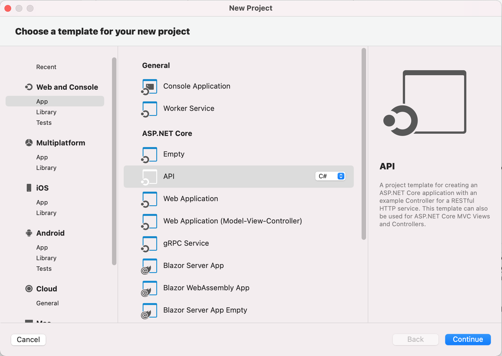
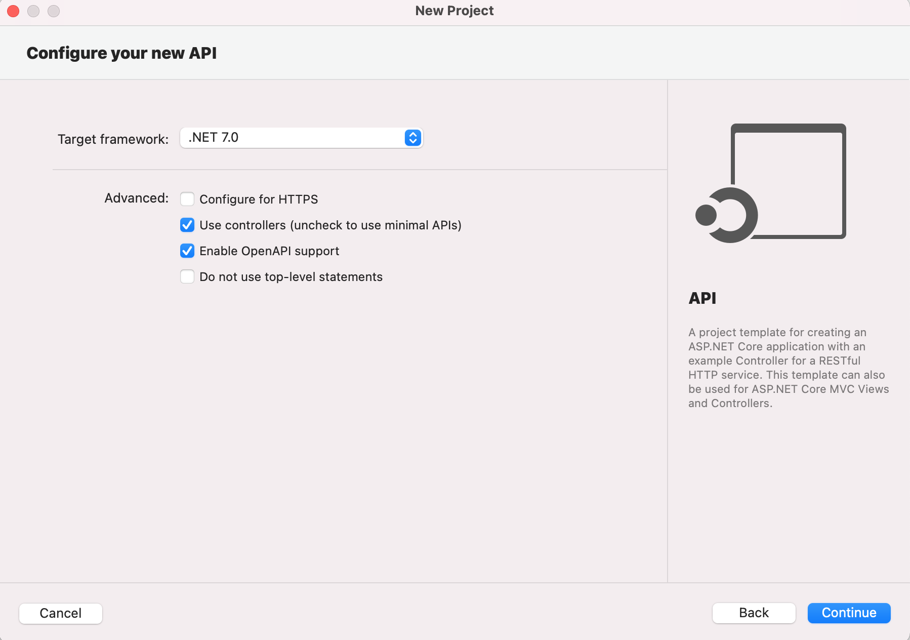
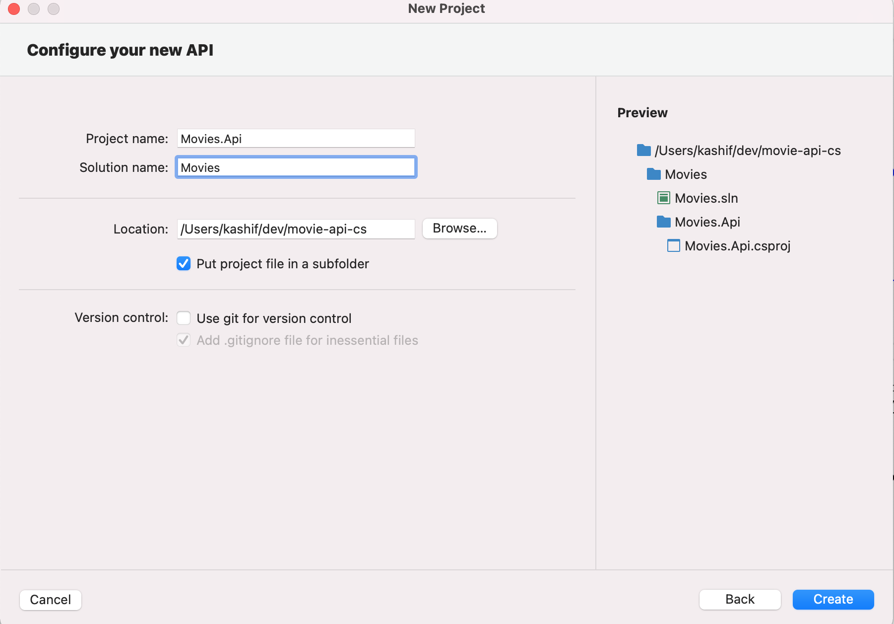
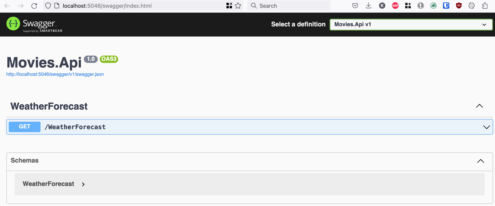

# REST API with ASP.NET Core 7 and InMemory Store

## What is a REST API?
An API, or application programming interface, is a set of rules that define how applications or devices can connect to and communicate with each other. A REST API is an API that conforms to the design principles of the REST, or representational state transfer architectural style. For this reason, REST APIs are sometimes referred to RESTful APIs.  

Focus of this tutorial to write a REST API using C# .NET.

## Create Web API Project
I am using Visual Studio 2022 for Mac on an Intel MacBook Pro.
* Select New -> App -> API project
<figure>
  <a href="images/001-select-template.png"></a>
  <figcaption>Select API Project Template.</figcaption>
</figure>  
* Configure API as below, I have not configured to use HTTPS for simplicity
<figure>
  <a href="images/002-configure-api.png"></a>
  <figcaption>Configure API Project.</figcaption>
</figure>  
* Name your project, I prefer to name my API project as [AggregateName].Api and name solution as [Aggregate Name], this comes from the Domain Driven Design, for this tutorial we are creating a REST API for Movies.
<figure>
  <a href="images/003-name-project.png"></a>
  <figcaption>Name API Project.</figcaption>
</figure>  
* Click the `Create` button would create the project.
* Right click on Dependencies and update nuget packages in Solution explorer.
* Clicking Run button would run the API and show the following
<figure>
  <a href="images/004-swagger-ui.png"></a>
  <figcaption>Movies API Swagger UI.</figcaption>
</figure>  

## Cleanup API Project
- Remove default WeatherForecast Model
- Remove default WeatherForecastController
- Click Add -> New File and select `Web API Controller Class`
- Name new contoller as MoviesController
- Click Run button to run the API and you should see Movies endpoints on Swagger UI
- Add another controller

## Add HealthChecks
Here is an excellent [article](Adding health checks with Liveness, Readiness, and Startup probes) on Liveness, Readiness and Startup health checks in ASP.NET Core.

Lets add a health check to our service.

- Register health check services
```csharp
builder.Services.AddHealthChecks();
```
- Map health checks endpoints
```csharp
app.MapHealthChecks("/healthz");
```
After running and going to this endpoint browser should show OK.  
We can later improve on it and add health checks for dependent services e.g. database, redis, downstream services etc.

## Solution/Project Organisation
There are 2 options for project organisation.
1. Keep all code in the same project and organise using the folders.
2. Create a class library project for each logical unit e.g. Domain, Data Storage, Services etc.
Objective of this is to keep related things together and help your future self and other team memebers to know where things are. For the purpose of this tutorial I will go with option 1 and keep all code in single project.

## Implement CRUD operations

### Add Domain Model
Lets start off by adding the domain model for our REST API.  This is not a representative of a real world but rather an example to cover few different types of fields in the model. Lets add a new folder named `Domain` in `Movies.Api` project and add a class named `Movie.cs`. It looks like following
```csharp
public class Movie
{
    public Guid Id { get; }
    public string Title { get; }
    public string Director { get; }
    public decimal TicketPrice { get; }
    public DateTime ReleaseDate { get; }
}
```
### Define supported API Operations
Lets also define the endpoints and operations that we are going to support in this API.
- `GET /api/movies` - Return all movies (in a production environment always implement pagging for this operation)
- `GET /api/movies/{id}` - Return a single movie by id in path parameter
- `POST /api/movies` - Create a new movie
- `PUT /api/movies/{id}` - Update a movie identified by id in path parameter
- `DELETE /api/movies/{id}` - Delete a movie by id in path parameter

### Store
This is a very simple CRUD API if there are more complex operations or business logic involved we would add another `Services` layer between `Controller` and `Store`. But adding just a storage layer is enough for the purpose of this tutorial.

Lets add another folder named `Store` and add an interface named `IMoviesStore` to perform CRUD operations that we need to support funcationality exposed by REST endpoints. This would look like following
```csharp
public interface IMoviesStore
{
    IEnumerable<Movie> GetAll();
    Movie GetByID(Guid id);
    void Create(CreateMovieParams createMovieParams);
    void Update(Guid id, UpdateMovieParams updateMovieParams);
    void Delete(Guid id);
}
```
I also like to add models/classes that would be used by Store, it is not really following DRY but IMO it makes this layer independent of any other layers in the project and any layer above this store can convert to/from models needed/returned by this layer.

#### InMemoryStore
To get this API working quickly lets add an InMemoryStore named `InMemoryMoviesStore` under `Store\InMemory` folder implementing the interface. We would use a dictionary to store the values. Other options are
* Concurrent Dictionay for thread safe storage
* Redis/Memcached for distributed memory caching

Register the newly created service in Dependency Injection in `Program.cs`
```csharp
builder.Services.AddSingleton<IMoviesStore, InMemoryMoviesStore>();
```

### Implement REST operations
Now the next step is to use the `IMoviesStore` in the controller and implement the endpoints for the users of the API.
Lets start by adding a variable and a constructor to set that variable, ASP.NET's dependency injection would create an instance of the store and pass to its constructor so we don't need to worry about that.
```csharp
    private readonly IMoviesStore moviesStore;

    public MoviesController(IMoviesStore moviesStore)
    {
        this.moviesStore = moviesStore;
    }
```

#### Get All `GET /api/movies`
Lets implement Get All endpoint `GET /movies`, first get a list of movies from store that would be of type `Store.Movie`, since we are returning `Domain.Movie`, we would need to convert to `Domain.Movie` type, I have implemented a constructor in `Domain.Movie` class that takes `Store.Movie` object as input and sets all the fields. This can be automated using [AutoMapper](https://automapper.org/) or [Boxed.Mapping](https://www.nuget.org/packages/Boxed.Mapping/). I have also added attributes to generate Swagger for the endpoints.
```csharp
    [HttpGet]
    [Produces("application/json")]
    [ProducesResponseType(typeof(IEnumerable<Domain.Movie>), StatusCodes.Status200OK)]
    public IActionResult Get()
    {
        var movies = moviesStore.GetAll().Select(x => new Domain.Movie(x));
        return Ok(movies);
    }
```

#### Get By Id `GET /api/movies/{id}`
In GetById endpoint we will try to get a movie from store, if the method returned `null` we would return HTTP status code `404 NotFound` to the caller of the API, if found we would convert the result to `Domain.Movie` and return it with `200 OK`.
```csharp
    [HttpGet("{id}")]
    [Produces("application/json")]
    [ProducesResponseType(typeof(Domain.Movie), StatusCodes.Status200OK)]
    [ProducesResponseType(typeof(Domain.Movie), StatusCodes.Status404NotFound)]
    public IActionResult Get(Guid id)
    {
        var movie = moviesStore.GetById(id);
        if (movie == null)
        {
            return NotFound();
        }

        return Ok(new Domain.Movie(movie));
    }
```

#### Create Movie `POST /api/movies/{id}`
For create movie, we would receive some data from the API caller, I like to add a model for request that only contain data that we are expecting from the caller. It also helps to apply Validation attributes only on the model that is being used in the controller. Once we have received the data we can convert it to store's `CreateMovieParams` and call method to store the resource. Following is the code for handler after the update
```csharp
    [HttpPost]
    [Consumes(typeof(CreateMovieRequest), "application/json")]
    [ProducesResponseType(StatusCodes.Status200OK)]
    [ProducesResponseType(StatusCodes.Status409Conflict)]
    public IActionResult Post([FromBody] CreateMovieRequest request)
    {
        try
        {
            moviesStore.Create(new CreateMovieParams(
                request.Id,
                request.Title,
                request.Director,
                request.TicketPrice,
                request.ReleaseDate
                ));
        }
        catch (DuplicateKeyException)
        {
            return Conflict();
        }

        return Ok();
    }
```
Again you can use AutoMapper to map request to `CreateMovieParams`. Also I have used a custom exception `DuplicateKeyException` to identify if it was a duplicate record. If we use database we should tranlate sql driver exception to this exception to keep our controller code idenpendent of the underlaying storage being used.

#### Update Movie `PUT /api/movies/{id}`
Same as create, we would receive some data from API caller, I have added another class to get update request data. Once we receive the request we call store's `Update` method to update movie. Following is the code for handler after the update
```csharp
    [HttpPut("{id}")]
    [Consumes(typeof(UpdateMovieRequest), "application/json")]
    [ProducesResponseType(StatusCodes.Status200OK)]
    [ProducesResponseType(StatusCodes.Status404NotFound)]
    public IActionResult Put(Guid id, [FromBody] UpdateMovieRequest request)
    {
        try
        {
            moviesStore.Update(id, new UpdateMovieParams(
                request.Title,
                request.Director,
                request.TicketPrice,
                request.ReleaseDate
                ));
        }
        catch (RecordNotFoundException)
        {
            return NotFound();
        }

        return Ok();
    }
```

#### Delete Movie `DELETE /api/movies/{id}`
Final operation supported by our REST API, delete movie. We simply call the `Delete` method on our store and return `NotFound` if record is not found or `OK` if deletion is successful.
```csharp
    [HttpDelete("{id}")]
    [ProducesResponseType(StatusCodes.Status200OK)]
    [ProducesResponseType(StatusCodes.Status404NotFound)]
    public IActionResult Delete(Guid id)
    {
        try
        {
            moviesStore.Delete(id);
        }
        catch (RecordNotFoundException)
        {
            return NotFound();
        }

        return Ok();
    }
```

## Test
I am not adding any unit or integration tests for this tutorial, perhaps a following tutorial. But all the endpoints can be tested either by the Swagger UI by running the application or using Postman.

## References
In no particular order  
[What is a REST API?](https://www.ibm.com/topics/rest-apis)  
[Adding health checks with Liveness, Readiness, and Startup probes](https://andrewlock.net/deploying-asp-net-core-applications-to-kubernetes-part-6-adding-health-checks-with-liveness-readiness-and-startup-probes/)  
[Health checks in ASP.NET Core](https://learn.microsoft.com/en-us/aspnet/core/host-and-deploy/health-checks?view=aspnetcore-7.0)  
[AutoMapper](https://automapper.org/)  
[Boxed.Mapping](https://www.nuget.org/packages/Boxed.Mapping/)  
[A Simple and Fast Object Mapper](https://rehansaeed.com/a-simple-and-fast-object-mapper/)  
And many more